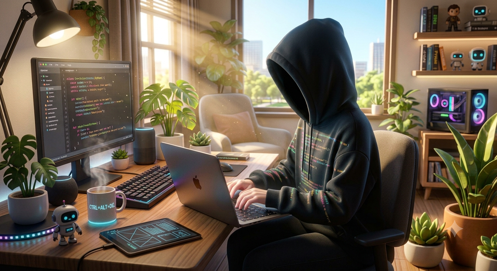

# Hi there, I'm Noof Saeed 👋 
### 🚀 Full-Stack Web Developer

  

 

  

---

## 💫 About Me

* 🔭 **Currently rocking as:** Freelancer Web Developer.
* 👀 **My Ultimate Goal:** Continuously pushing boundaries to improve skills, experience, and knowledge.
* 🌱 **My Passion:** I absolutely love learning, exploring, and discovering everything new in the tech world.
* 📬 **Get in touch:** Let's build something awesome together! Drop me a line at [eng.noofsaeed@gmail.com](mailto:eng.noofsaeed@gmail.com).

---

## 🛠️ Technologies & Tools

### 🌐 Frontend & Backend

  
  
  
  
  
  

### 🏗️ Frameworks & Databases

  
  
  
  

### 🧪 Automation Testing & PM

  
  
  

---

<!-- ## 📊 My GitHub Stats

 
  

 -->

---

## 📈 Contribution Graph

  

  

